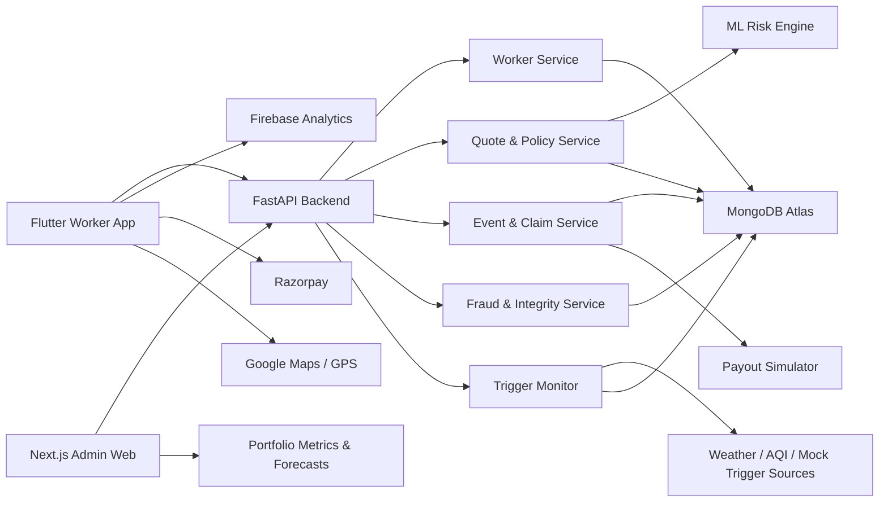
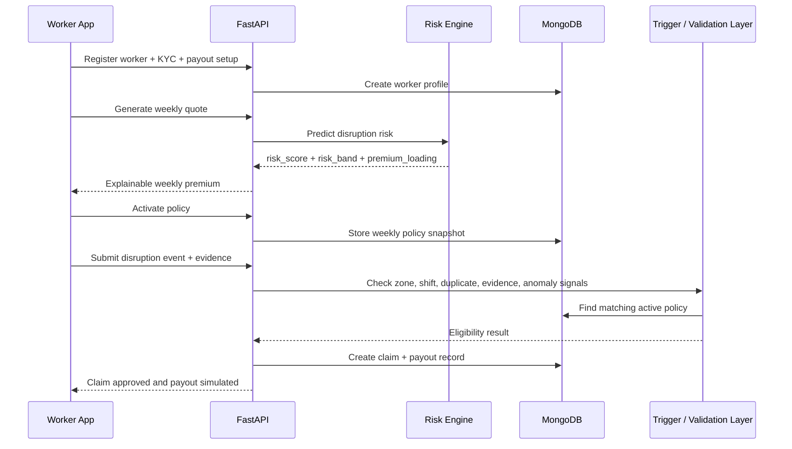

# GigSuraksha

<p align="center">
  
</p>

<p align="center">
  <strong>AI-powered weekly income protection for India's quick-commerce delivery workforce.</strong>
</p>

<p align="center">
  GigSuraksha protects delivery partners against measurable external disruptions like heavy rain,
  waterlogging, severe AQI, extreme heat, platform outages, dark-store downtime, and access restrictions.
</p>

<p align="center">
  
  
  
  
  
  
</p>

## Pitch Deck
- Pitch Deck Link: [https://canva.link/0xizo8okzt445dt](https://canva.link/0xizo8okzt445dt)
- PDF Link - [https://drive.google.com/file/d/1_e23iOv894RX53saiuEt_S8ILZZs0ZP9/view?usp=sharing](https://drive.google.com/file/d/1_e23iOv894RX53saiuEt_S8ILZZs0ZP9/view?usp=sharing)

## Demo Video
[](https://www.youtube.com/watch?v=9FJZ7M_5NVo)


## Judge TL;DR

- **Problem:** gig workers lose income when external disruptions stop deliveries.
- **Coverage:** income loss only, not health, life, accidents, or vehicle repairs.
- **Model:** weekly pricing, zone-specific cover, shift-specific protection.
- **Experience:** Android Flutter app for workers, web dashboard for admins.
- **Intelligence:** AI-assisted pricing and portfolio forecasts with rule-based claims.
- **Trust layer:** 3-angle selfie KYC, GPS validation, scene evidence, anomaly detection.
- **Outcome:** fast quote, automated trigger evaluation, explainable claim decision, instant payout simulation.

## Why GigSuraksha Exists

India's delivery partners operate on narrow weekly cash cycles. If a flood, heatwave, severe AQI spike,
platform outage, or dark-store shutdown hits during their most valuable shift, they lose income immediately.
Traditional insurance is simply not designed for this kind of short-duration, hyperlocal, recurring livelihood risk.

GigSuraksha turns that problem into a product that is:

- **weekly**, because gig workers budget week-to-week
- **parametric**, because disruption triggers can be measured
- **explainable**, because insurance trust matters
- **fraud-aware**, because payout confidence matters just as much as speed

## What We Built

| Surface | What It Does | Why It Matters |
| --- | --- | --- |
| **Flutter worker app** | onboarding, KYC, quote, policy activation, GPS, evidence capture, claims, profile | gives workers a fast mobile-first protection experience |
| **FastAPI backend** | worker registry, quote engine, policy creation, event simulation, claim automation, payout simulation | powers the insurance workflow end-to-end |
| **ML risk module** | weekly disruption risk prediction, risk bands, premium loading hints, admin forecasts | keeps pricing dynamic but still understandable |
| **Next.js admin console** | portfolio metrics, disruption mix, claims trends, trigger automation, forecast visibility | gives insurers and judges a complete operational view |

## Phase 3 Highlights

### Worker Trust and Verification

- 3-angle selfie KYC during registration
- worker profile trust surface with selfie history
- UPI-linked payout setup
- GPS-backed live location confidence

### Claim Automation

- event-driven claim triggering
- zone and shift overlap checks
- duplicate claim prevention
- anomaly scoring before payout
- simulated instant payout processing

### Evidence-Aware UX

- on-site disruption proof capture
- safety override flow for unreachable or unsafe zones
- worker notes and image attachment
- evidence packets linked back to claims for review

### Admin Intelligence

- live worker, policy, event, claim, and payout counts
- disruption mix by event type
- automated trigger monitor run
- next-week forecast cards for premium readiness

## Product Journey

| Step | Worker View | System Action |
| --- | --- | --- |
| `1` | Registration | captures city, platform, zone, shift, weekly income, UPI |
| `2` | KYC | stores 3-angle selfie verification for trust scoring |
| `3` | Quote | ML predicts disruption exposure and risk band |
| `4` | Policy activation | backend creates weekly cover snapshot and premium |
| `5` | GPS + monitoring | app records location confidence for claim context |
| `6` | Disruption claim | worker submits evidence or uses safety override |
| `7` | Validation | backend checks policy, zone, shift, event, duplicates, anomalies |
| `8` | Payout | eligible claim is auto-created and payout is simulated instantly |

## Architecture



## Claim Automation Flow



## Why This Design Works

### AI Where It Helps

We use AI for:

- weekly disruption risk prediction
- risk scoring and banding
- premium loading guidance
- portfolio forecasting for admin visibility

### Rules Where Trust Matters

We keep these parts deterministic and explainable:

- final weekly premium calculation
- policy validity window
- zone and shift eligibility
- claim acceptance logic
- duplicate prevention
- payout amount calculation

This gives us the best of both worlds: adaptive pricing with insurer-grade clarity.

## Repository Structure

```text
GigSuraksha/
├── Backend/
│   ├── app/
│   │   ├── repositories/
│   │   ├── services/
│   │   └── utils/
│   ├── samples/
│   └── tests/
├── Ml/
│   ├── data/
│   ├── models/
│   ├── reports/
│   └── src/
├── frontend/
│   ├── src/app/
│   ├── src/components/
│   └── src/lib/
├── gig_suraksha_app/
│   ├── android/
│   ├── assets/
│   ├── ios/
│   └── lib/
└── README.md
```

### Folder Guide

| Path | Purpose |
| --- | --- |
| `gig_suraksha_app/` | Android-first Flutter app for workers |
| `frontend/` | web experience and insurer/admin dashboard |
| `Backend/` | FastAPI APIs, claim engine, trigger monitor, payout simulation |
| `Ml/` | training, evaluation, inference, and reporting for weekly disruption risk |

## Demo Scenarios Covered

- heavy rainfall
- waterlogging
- severe AQI
- extreme heat
- platform outage
- dark-store downtime
- zone restriction

## Tech Stack

| Layer | Stack |
| --- | --- |
| Mobile app | Flutter, Dart, Provider, Firebase Analytics, Razorpay, Google Maps, Geolocator |
| Backend | FastAPI, Python, Pydantic, Motor, MongoDB Atlas |
| Admin web | Next.js, React, TypeScript, Tailwind CSS, Recharts |
| ML | Pandas, NumPy, scikit-learn, XGBoost, Joblib |
| Infra | Fly.io, Firebase, MongoDB Atlas |

## Local Development

### Backend

```bash
cd Backend
python3 -m venv .venv
source .venv/bin/activate
pip install -r requirements.txt
uvicorn app.main:app --reload
```

### Mobile App

```bash
cd gig_suraksha_app
flutter pub get
flutter run
```

### Web Admin

```bash
cd frontend
npm install
npm run dev
```

### ML Module

```bash
cd Ml
python3 -m src.pipeline --start-date 2023-01-01 --end-date 2026-03-29
```

## Live Links

- Worker/Admin web: [gigsuraksha-beta.web.app](https://gigsuraksha-beta.web.app/)
- Backend API: [gigsuraksha-backend.fly.dev](https://gigsuraksha-backend.fly.dev)
- Demo video: [YouTube walkthrough](https://youtu.be/AqH0dfiZbP4)

## What Judges Should Remember

GigSuraksha is not a generic insurance concept. It is a complete, end-to-end livelihood protection platform
for delivery workers, built around the actual realities of the gig economy:

- weekly income cycles
- hyperlocal operating zones
- short-duration but high-impact disruptions
- trust-sensitive claim flows
- fraud-aware, explainable automation

We are not insuring vehicles. We are not insuring health. We are insuring **earning continuity**.
