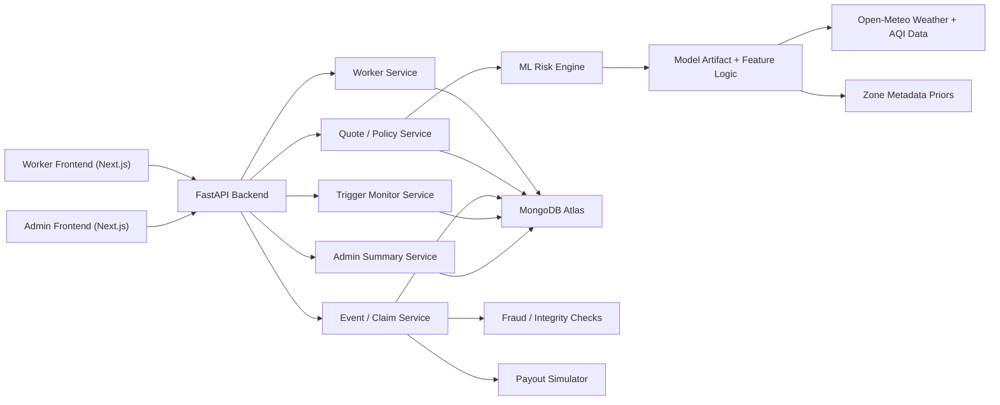
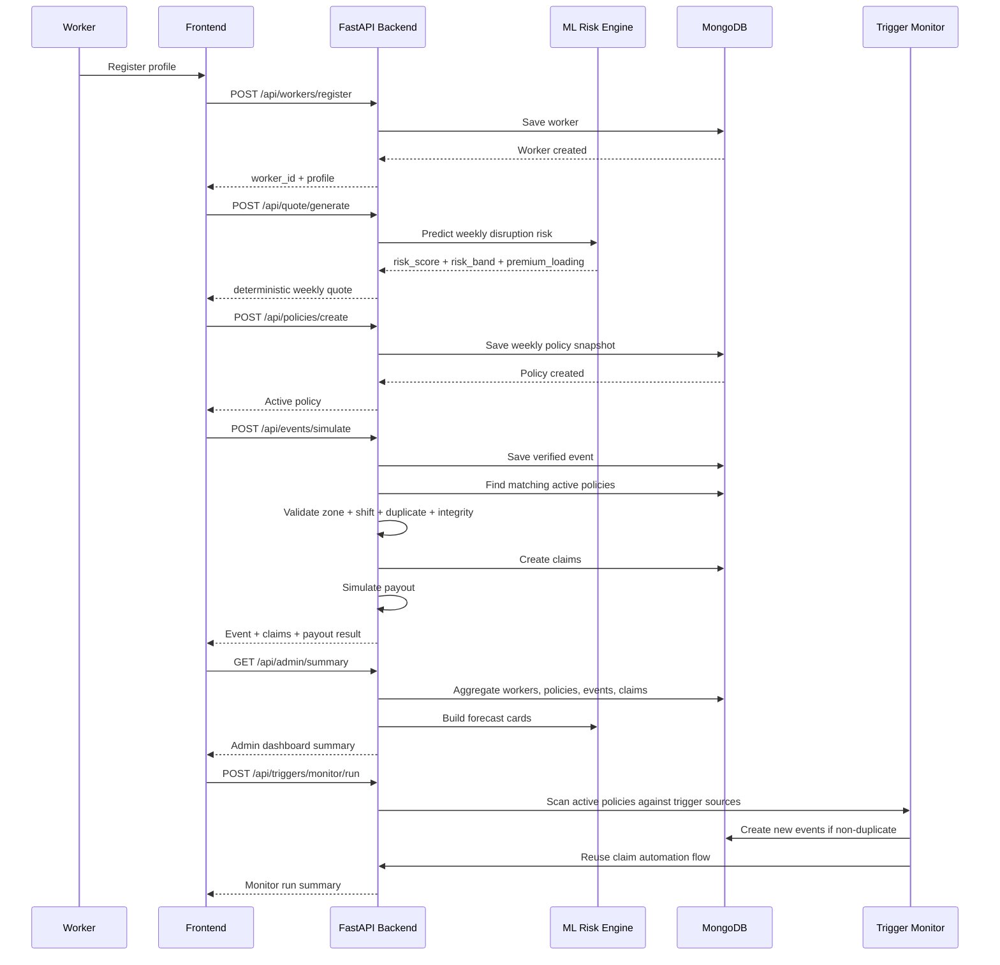

# GigSuraksha

AI-enabled parametric income protection for India's quick-commerce delivery partners.

GigSuraksha is built for riders working on Blinkit, Zepto, Instamart, and similar platforms whose earnings are vulnerable to measurable external disruptions such as heavy rainfall, waterlogging, severe AQI, extreme heat, platform outages, dark store downtime, and zone access restrictions.

This project is intentionally narrow and practical:

- coverage scope: **loss of income only**
- pricing model: **weekly**
- claim model: **parametric and automated**
- ML role: **risk forecasting and premium loading inputs**
- claim decisions: **deterministic and rule-based**

## Live Links

- Live frontend: [https://gigsuraksha-beta.web.app/](https://gigsuraksha-beta.web.app/)
- Live backend API: [https://gigsuraksha-backend.fly.dev](https://gigsuraksha-backend.fly.dev)
- Demo video: [https://youtu.be/AqH0dfiZbP4](https://youtu.be/AqH0dfiZbP4)

## Problem We Are Solving

Quick-commerce riders earn in narrow, high-value time windows inside hyperlocal zones. A 2-3 hour disruption during evening rush can wipe out a meaningful share of their weekly earnings. Today, most riders absorb that loss personally.

We built GigSuraksha as a weekly safety net for those lost earning hours.

## Our Persona

- urban quick-commerce delivery riders
- city + zone-based work patterns
- shift-based earning behavior
- weekly cash flow and weekly expenses
- high exposure to short-duration external disruptions

This is why our product is zone-specific, shift-specific, and weekly by design.

## What Makes GigSuraksha Different

- We do **not** build generic “gig worker insurance.”
- We do **not** cover health, life, accidents, or vehicle repairs.
- We insure **pre-declared earning windows** in **pre-declared operating zones**.
- ML helps estimate weekly disruption risk, but **final pricing and claims stay explainable**.
- The worker simulation flow is **policy-bound**, so workers cannot freely claim arbitrary zones.

## End-to-End Product Flow

1. Worker registers with city, platform, operating zone, insured shift, weekly earnings, and weekly active hours.
2. The platform runs the weekly disruption risk model and returns:
   - expected disrupted hours next week
   - risk score
   - risk band
   - ML premium loading
3. The backend computes the final weekly premium using a deterministic formula.
4. The worker activates a weekly policy.
5. Verified disruptions are ingested manually or through the automated trigger monitor.
6. The backend checks:
   - active policy
   - zone match
   - shift overlap
   - verified event
   - duplicate prevention
   - location/activity integrity signals
7. If eligible, a claim is auto-created and a simulated payout is processed.
8. Worker and admin dashboards show live policy, event, claim, payout, and forecast data.

## Architecture Overview

### System Architecture



### Phase 2 Operational Flow



### Decision Boundary: ML vs Rules

- ML is used for:
  - weekly disruption risk prediction
  - risk score and risk band generation
  - premium loading input
  - forecast cards for admin visibility
- Deterministic rules are used for:
  - final weekly premium calculation
  - policy validity logic
  - shift overlap logic
  - claim eligibility
  - duplicate prevention
  - anomaly gate for payout processing
  - payout amount calculation

## Phase 2 Deliverables Implemented

### 1. Registration Process

- worker onboarding flow in the frontend
- backend worker registration and retrieval
- MongoDB-backed worker persistence

### 2. Insurance Policy Management

- quote generation from registered worker context
- policy creation using `worker_id`
- weekly policy snapshot with:
  - validity window
  - insured shift
  - coverage tier
  - premium breakdown
  - coverage summary
- policy retrieval for worker and individual policy views

### 3. Dynamic Premium Calculation

- ML-backed weekly disruption prediction
- risk score, risk band, and premium loading
- deterministic premium formula:

```text
Final Weekly Premium =
  Base Premium
+ Zone Risk Loading
+ Shift Exposure Loading
+ Coverage Factor
+ ML Risk Loading
- Safe Zone Discount
```

Current mappings:

- Base Premium = `29`
- ML Loading = `LOW: 3`, `MEDIUM: 8`, `HIGH: 12`
- Coverage Factor = `basic: 4`, `standard: 7`, `comprehensive: 10`
- Shift Loading = `morning_rush: 3`, `afternoon: 2`, `evening_rush: 5`, `late_night: 4`

### 4. Claims Management

- verified event simulation
- automatic claim creation from active policies
- claim retrieval by worker and claim ID
- payout estimate plus simulated payout processing
- worker claim history and claim validation view

## AI / ML System

The ML model predicts:

- `expected_disrupted_hours_next_week`

for each:

- city
- zone
- shift type
- week context

It produces:

- `risk_score`
- `risk_band`
- `premium_loading`

### Data Inputs

- Open-Meteo historical weather
- Open-Meteo air quality
- manually curated zone priors for demo zones

### Feature Themes

- rainfall intensity and persistence
- heat stress exposure
- severe pollution exposure
- weather volatility
- recent disruption hours
- zone flood proneness
- AQI sensitivity
- zone access risk
- shift exposure

### Important Modeling Principle

ML does **not** directly decide the premium or approve the claim.

It only provides risk inputs to an otherwise deterministic pricing and operations system.

## Parametric Triggers Implemented

Supported live/simulated triggers:

- heavy rainfall
- waterlogging
- heat stress
- severe AQI
- platform outage
- dark store unavailable
- zone access restriction

## Fraud Detection and Integrity Controls

Phase 2 includes explainable fraud and integrity checks:

- duplicate claim prevention
- policy active check
- zone match check
- shift overlap check
- verified event check
- location match check from event metadata
- activity validation from event metadata
- anomaly scoring band:
  - `LOW`
  - `MEDIUM`
  - `HIGH`

We also added simulated payout blocking for highly anomalous claims.

## Automated Trigger Monitoring

The backend now includes an automated trigger monitor that scans active policies against mocked integration sources:

- weather mock
- traffic mock
- platform mock

This supports:

- candidate event generation
- event deduplication
- automatic event creation
- automatic claim creation from matching policies

## Worker Experience

Frontend flow implemented:

- landing page
- onboarding
- live quote page
- policy summary page
- worker-bound simulation page
- claim page
- worker dashboard
- admin dashboard

Important UX choice:

- the simulation page is now **bound to the active worker policy**
- the worker cannot manually choose arbitrary zone and shift combinations to simulate self-claims

## Admin Experience

The admin dashboard shows:

- total workers
- total active policies
- total events
- total claims
- claims by status
- claims by disruption type
- recent events
- recent claims
- next-week disruption forecast cards
- latest automated trigger monitor run

## Deployment Status

### Backend

Deployed on Fly.io:

- [https://gigsuraksha-backend.fly.dev](https://gigsuraksha-backend.fly.dev)

The deployed backend includes:

- FastAPI API layer
- integrated ML quote/risk engine
- MongoDB persistence
- automated trigger monitor
- claim automation
- simulated payout processing

### Frontend

- live frontend: [https://gigsuraksha-beta.web.app/](https://gigsuraksha-beta.web.app/)
- integrated with the deployed backend
- verified with `lint` and production build
- ready to be hosted separately if needed

## Repository Structure

```text
GigSuraksha/
├── Backend/
├── Ml/
├── frontend/
├── videos/
└── README.md
```

Detailed module docs:

- [`Backend/README.md`](/Users/loopassembly/Desktop/GigSuraksha/Backend/README.md)
- [`Ml/README.md`](/Users/loopassembly/Desktop/GigSuraksha/Ml/README.md)
- [`frontend/README.md`](/Users/loopassembly/Desktop/GigSuraksha/frontend/README.md)

## Tech Stack

### Frontend

- Next.js
- React
- TypeScript
- Tailwind-style utility classes

### Backend

- FastAPI
- Pydantic
- MongoDB Atlas
- Fly.io

### ML

- Python
- Open-Meteo APIs
- interpretable tabular risk modeling
- portable pure-Python model artifact for current environment compatibility

## Testing and Verification

Backend:

```bash
PYTHONPATH=Backend python3.10 -m unittest discover -s Backend/tests -p 'test_*.py'
```

Frontend:

```bash
cd frontend
npm run lint
npx next build --webpack
```

## What We Learned

- the strongest insurance ideas are the most measurable ones
- weekly pricing fits the earning rhythm of quick-commerce riders better than monthly products
- product design itself is a fraud-defense layer
- AI works best in insurance when it supports operational judgment rather than replacing explainable rules

## Challenges We Faced

- narrowing the scope to income loss only and resisting feature bloat
- designing claims around measurable triggers instead of vague income drops
- separating ML-assisted forecasting from money-moving claim logic
- keeping the product honest and explainable while still feeling automated and intelligent

## Phase 2 Outcome

GigSuraksha now demonstrates the complete Phase 2 MVP loop:

1. register a worker
2. generate a weekly ML-backed quote
3. activate a weekly policy
4. create or monitor disruption events
5. auto-create claims from matching policies
6. simulate payout processing
7. inspect worker and admin dashboards

This gives us a working, explainable, hackathon-ready parametric income protection platform for India’s quick-commerce workforce.
